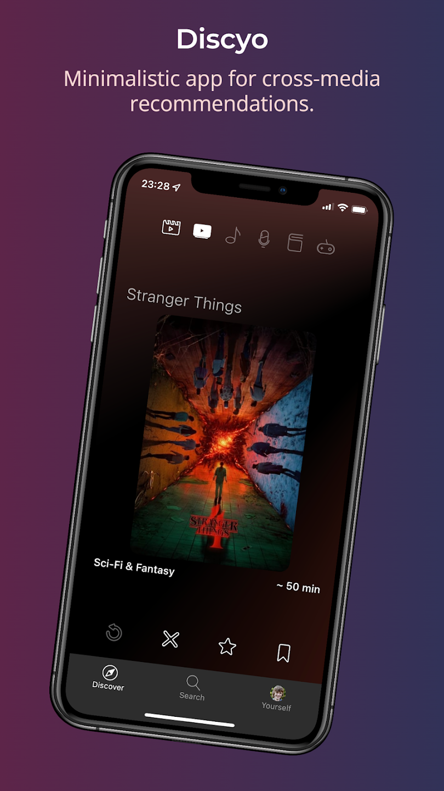
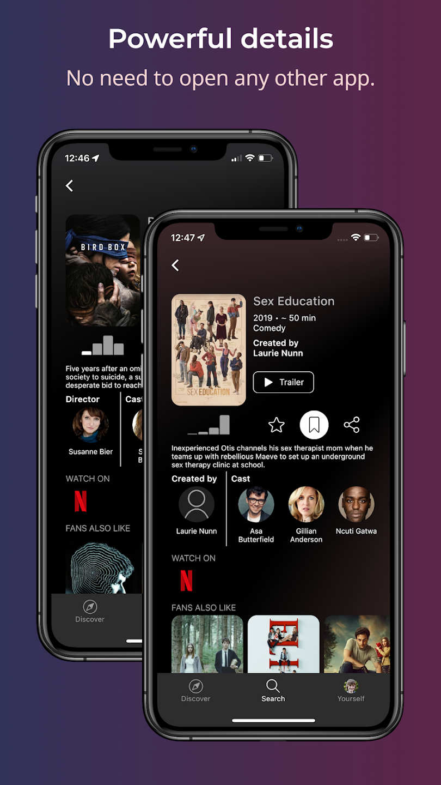
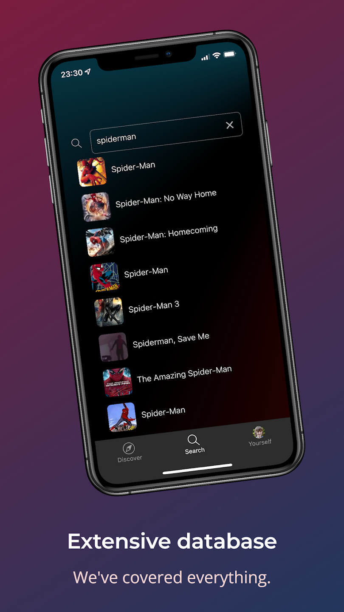
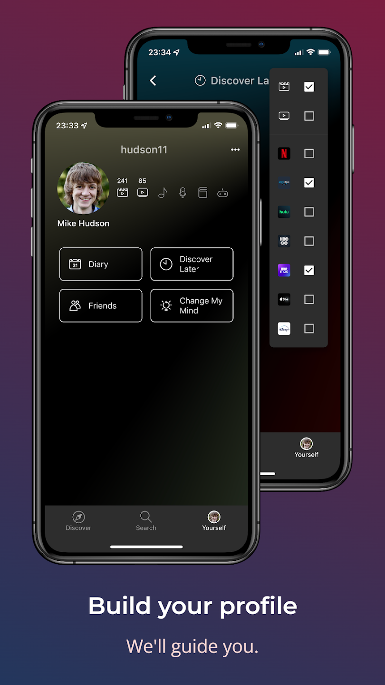

# Discyo App

This is a [Flutter](https://flutter.dev/) app made as a part of [Discyo](https://discyo.com/) - a cross-media recommendation platform project.

  
  
  
  

## Getting started

In order to build and run the app, you'll need to have [Flutter](https://flutter.dev/) installed.
In the root folder, run `flutter pub get` to download all the necessary packages.
You'll then need to get a [TMDB API key](https://developers.themoviedb.org/3).
Once you obtain it, replace the `<YOUR_TMDB_KEY>` placeholder inside `lib/api.dart`.

## Running in iOS simulator

First, open up `ios/Runner.xcworkspace` and in the *Runner* project settings in the *Signing and Capabilities* tab, choose your development team and some unique app id.
You'll need to have the paid account to support notifications and *Sign in with Apple*, but if you don't have it, you can simply remove the capabilities, just be aware that these features won't work.
Finally, open up the iOS simulator (e.g. using Spotlight, typing "Simulator" and hitting Enter) and run `flutter pub run` to launch the app.

## Building an APK

To build an APK, you'll need to [create a keystore](https://docs.flutter.dev/deployment/android#create-an-upload-keystore) and [reference it](https://docs.flutter.dev/deployment/android#reference-the-keystore-from-the-app) by creating a `key.properties` file inside the `android` folder (see the links for more info on how to do this).
After that is set up, you can run `flutter build apk` which will build the APK for you.
